```{r setup, include=FALSE}
options(htmltools.dir.version = FALSE)
library(here)
```

layout: true

<div class="my-header"></div>
<div class="my-footer">
  <div class="my-info">
      <a href="https://marionlouveaux.fr/">marionlouveaux.fr</a>
      <a href="https://twitter.com/MarionLouveaux">@MarionLouveaux</a>
  </div>
  <div class="my-logo">
  </div>
</div>       


---
# Icy, a bioimage analysis software    

```{r, echo=FALSE}
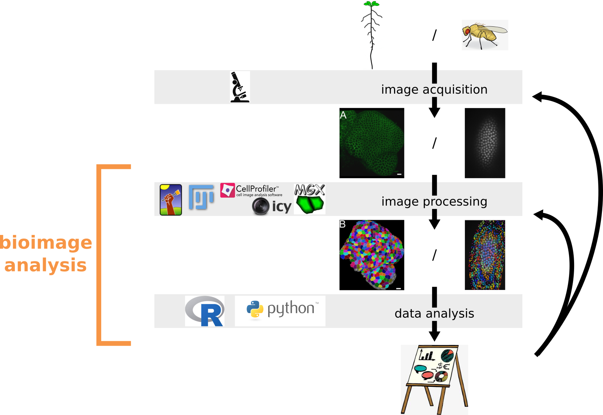
```


---
# Examples of Icy application to zebrafish

**Quantitative analysis of fluorescence lifetime with the Icy plugin ROI intensity evolution**

```{r, echo=FALSE, fig.align='center'}
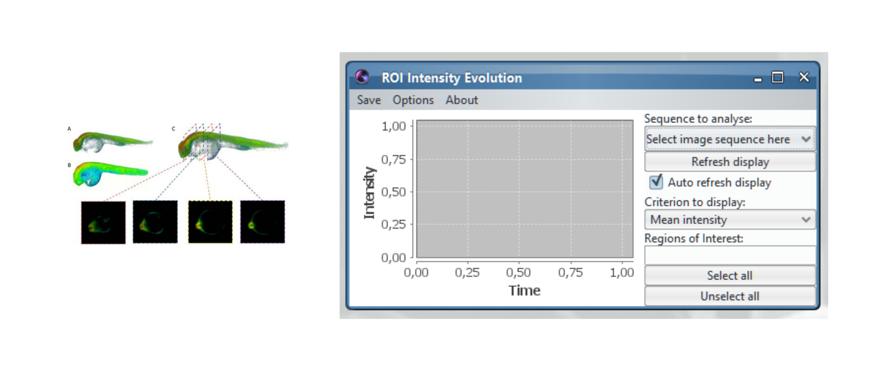
```

> Andrews et al. J. Biophotonics 9, No. 4, 414–424 (2016)         
http://icy.bioimageanalysis.org/plugin/roi-intensity-evolution/ 

???
OPT (optical projection tomography) imaging of zebrafish embryos (mounted in low melting agarose in FEP tubes with a bit of anaestetic) expressing FRET biosensor
Analysis of fluorescence lifetime of the biosensor when cleaved by the Caspase 3 (apoptosis) with Matlab tool
fluo lifetime data (fluo decay over time) given to Icy plugin used to compare irradiation conditions: count of the number of pixels above threshold -of decay-. Authors hijacked plugin which is meant to measure fluo intensity variations.


---
# Examples of Icy application to zebrafish

**Correlative Light Electron Microscopy (CLEM) with the ec-CLEM plugin** 

```{r, echo=FALSE, out.width="75%", fig.align='center'}
knitr::include_graphics("images/CLEM_zebra.png")
```


> Wong et al., Developmental Cell 52, 1–17 (2020)          
Kuri et al., J. Cell Biol. Vol. 216 No. 9 2891–2909 (2017)            
http://icy.bioimageanalysis.org/plugin/ec-clem/        

???
Wong
change chemokine levels in an inducible manner and measure
the response of one collectively migrating tissue, the lateral
line primordium
Cxcr7b (receptor) is rapidly upregulated in response to elevated chemokine levels via a degradation-to-recycling intracellular trafficking switch
CLEM to look at clusters of Cxcr7b receptors
 In control embryos, the majority of
Cxcr7b-GFP spots localized to multivesicular bodies (MVBs)
and, to a lesser extent, the Golgi apparatus.
In chemokineflooded embryos, there was a marked increase in Cxcr7b-GFP
localization to tubulovesicular clusters, densities of small tubules
and vesicles of 40–80 nm in diameter
 tubulovesicular clusters
are the source of the Cxcr7b increase during chemokine
adaptation.

Kuri 
zebrafish larvae
ASC protein, part of the inflammasome complex. Protein complex involved in the detection of danger or pathogenic stimuli by specific pattern-recognition receptors
Localisation of Asc specks with CLEM, allow to discover its filamentous structure on the electron micrograph


---
# Examples of Icy application to zebrafish

**Quantitative analysis of actin dynamics using the BioFlow plugin**

```{r, echo=FALSE, fig.align='center'}
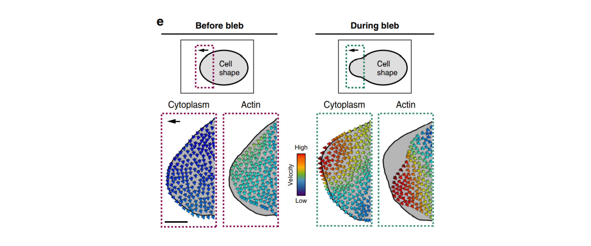
```

> Grimaldi et al. Nature Communications 11:5397 (2020)            
http://icy.bioimageanalysis.org/plugin/bioflow/         

???
zebrafish primordial germ cells to study the role of cell-cell adhesion in bleb-driven single-cell migration in vivo.
analysis of the actin flow with or without deregulating E-cadherin
 
cell segmentation with active contours
estimation of velocity fields within the cell (cytoplasm, actin or E-cadherin): extracting the motion of intracellular material observed using fuorescence microscopy (optical flow technique: displacement of pixels between image pairs, look at the changes of pixel intensities between image, assume there is no change in brightness), while simultaneously inferring the parameters of a given theoretical model of the cell interior (fuid dynamics model)

---
# Examples of Icy application to zebrafish

**Unwrapping the aorta tube with the TubeSkinner plugin**         

```{r, echo=FALSE, out.width="80%", fig.align='center'}
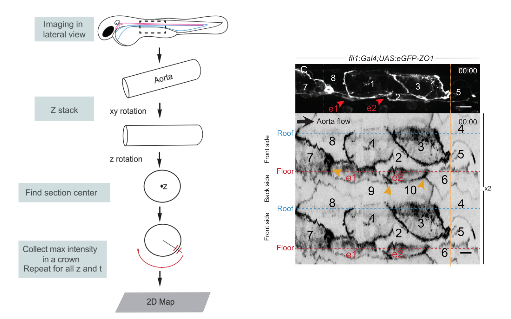
```

> Lancino et al, eLife 2018;7:e37355 (2018)          
http://icy.bioimageanalysis.org/plugin/tubeskinner/  

???
zebrafish embryos
role of physical forces on the formation of blood stem cells. Study of the contraction of the aorta. Icy plugin unwraps the aorta tube, which helps to understand the imaged phenomenon and locate stem cells in the aorta


       

---
# The origins of the Icy software      

```{r, echo=FALSE}
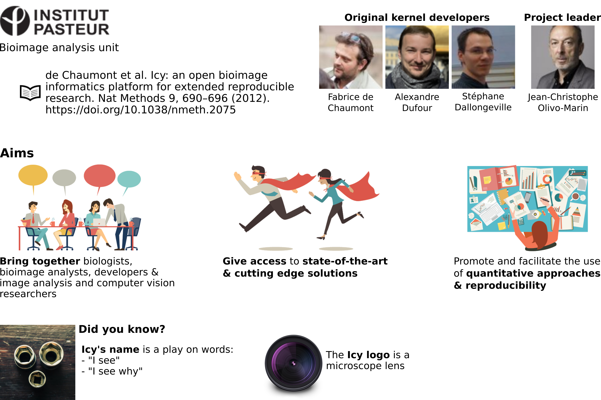
```

---
# Icy now      


**The Icy team**     

- Maintain the kernel of Icy 2.0
- Prepare the future of Icy        
- Foster the community dynamic      
    - Maintain the website: http://icy.bioimageanalysis.org/      
    - Communicate around Icy     
- The Icy team recently started "Icy Services", a commercial platform to provide services around Icy for industries and academics. See http://icy.bioimageanalysis.org/services/    

```{r, echo=FALSE, out.width="30%", fig.align='center'}

```


**Icy contributors outside the Icy team**      

- Develop and maintain their plugins and protocols             
- Report bugs and ask for feature requests on the kernel           
- Help each other and users of their plugins                


---
# The choice of a developed & unified GUI            

```{r, echo=FALSE}
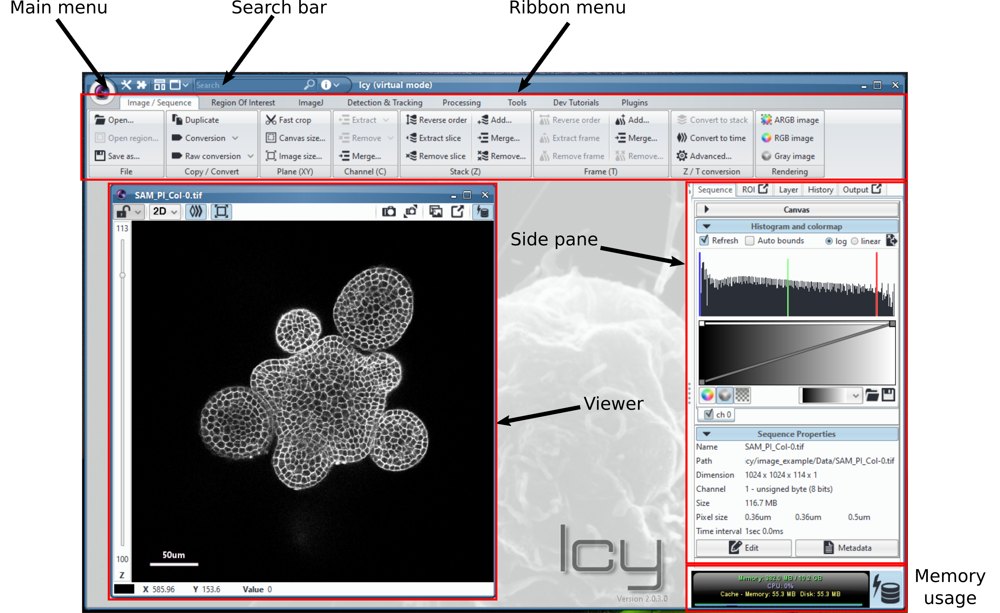
```

> Image: SAM_PI_Col-0.tif, from http://doi.org/10.5281/zenodo.2577053   

???
1. A unified graphical user interface       
      - No floating windows      
      - Unified plugins layout     
      - Condensed information (see the side pane)
2. Everything at your fingertips
      - Ribbon menu: quick access to basic operations & main plugins      
      - Side pane: display options, ROI manager with result table, overlays control, history and log window       
3. Make the software easier to use       
      - Search bar: access all tools, even if not yet installed
      - Direct access to online documentation & website     
      - Possibility to send bug reports and log files directly from the GUI       

---
# Display options & sequence properties        
         
```{r, echo=FALSE}
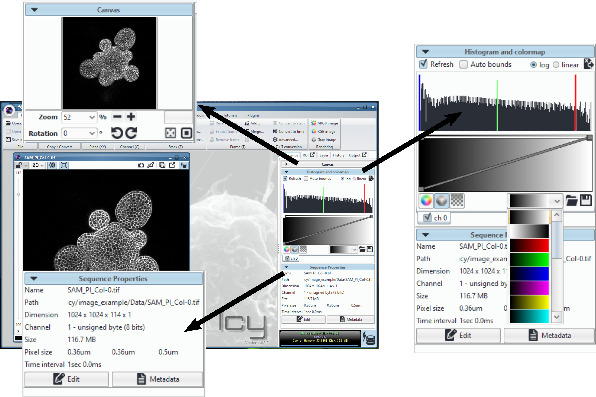
```

> Image: SAM_PI_Col-0.tif, from http://doi.org/10.5281/zenodo.2577053  
       

---
# Viewer options 
         
```{r, echo=FALSE}
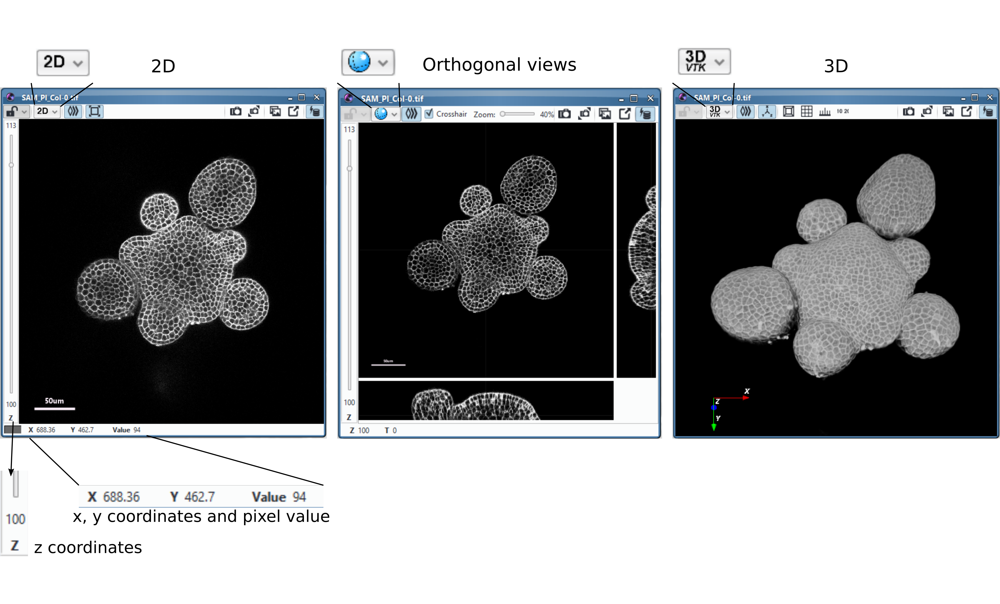
```

> Image: SAM_PI_Col-0.tif, from http://doi.org/10.5281/zenodo.2577053  

---
# Windows synchronization         

![:col_row 

```{r, echo=FALSE, out.width="100%"}
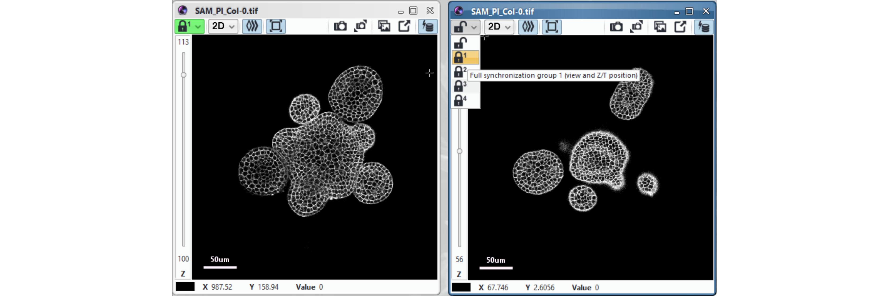
```
]  
![:col_row 
<center>
<iframe width="400" height="250" src="https://www.youtube.com/embed/EQyM1UQw4xc?list=PLTzQ6G6h35v9fC0tkJ_2ZNLfm5SN1ZLlv" frameborder="0" allow="accelerometer; autoplay; encrypted-media; gyroscope; picture-in-picture" allowfullscreen></iframe>
</center>

]

> Image: SAM_PI_Col-0.tif, from http://doi.org/10.5281/zenodo.2577053  


---
# Plugins and protocols


```{r, echo=FALSE}
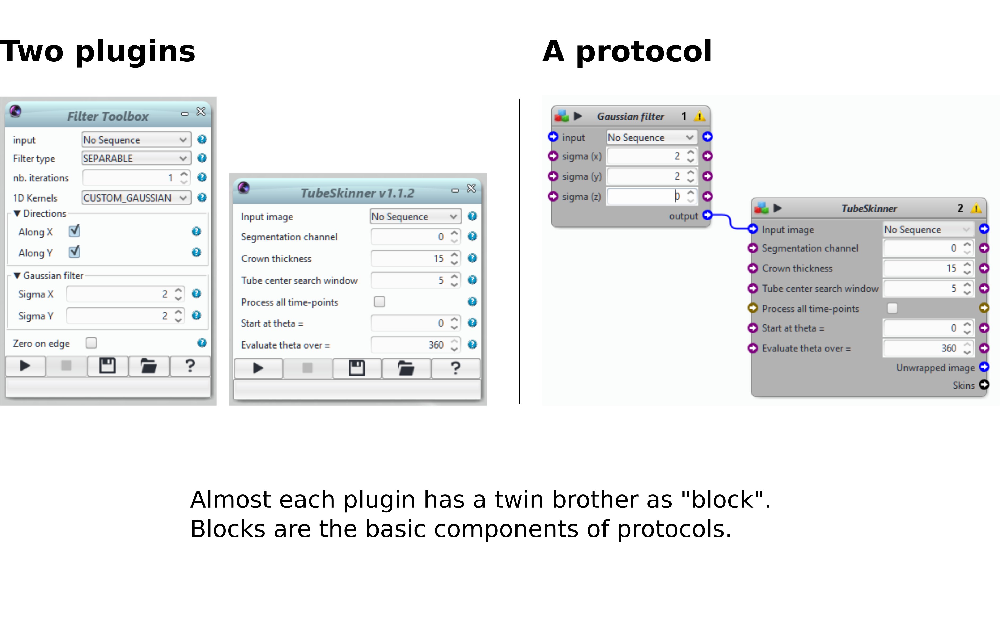
```


---
# A growing number of plugins and protocols     

```{r, echo=FALSE}
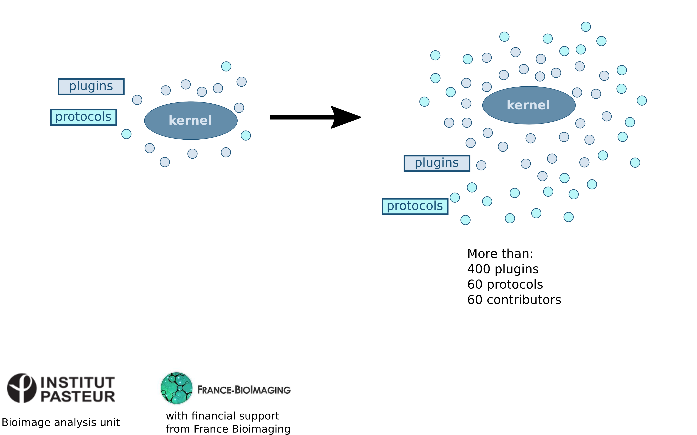
```


---
# Central repository for plugins and protocols  

```{r, echo=FALSE}
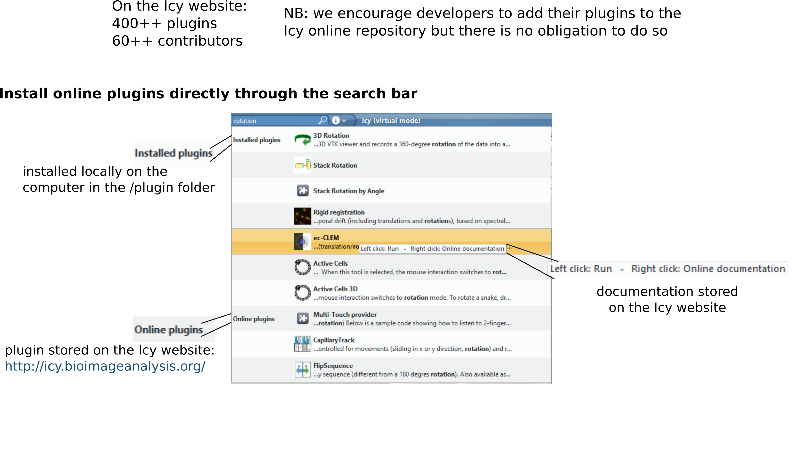
```

> http://icy.bioimageanalysis.org/plugins/


---
# A plugin example, the 3D rotation plugin          

![:col_row 

```{r, echo=FALSE, out.width="80%"}
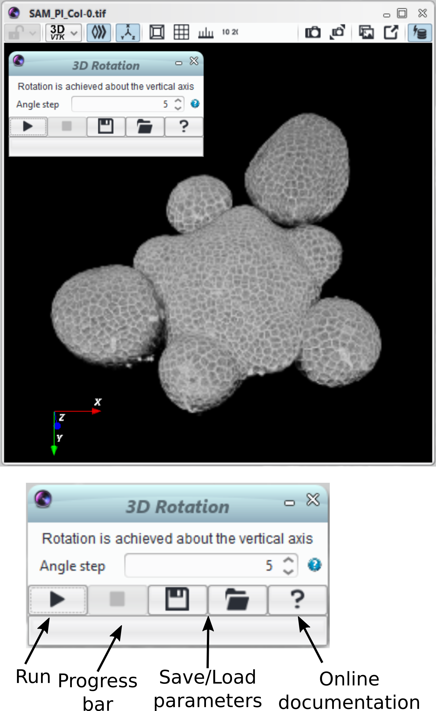
```
,

```{r, echo=FALSE, out.width="100%"}
knitr::include_graphics("images/3D rotated view of SAM_PI_Col-0_0ms.gif")
```
]

> http://icy.bioimageanalysis.org/plugin/3d-rotation/     
 

---
# Highlighting some key plugins    

Counting spots with *Spot detector*             

```{r, echo=FALSE, out.width="80%"}
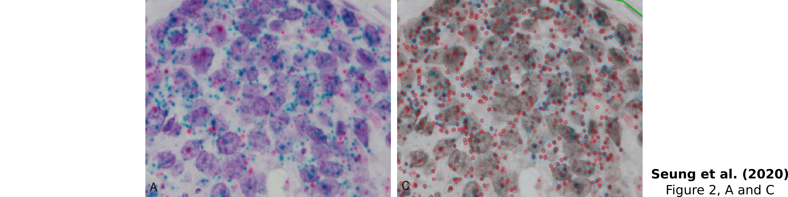
```

![:col_row Segmentation with <i>Active contours</i>, Tracking with <i>Track Manager</i>, Flow analysis with <i>BioFlow</i>]
![:col_row 
```{r, echo=FALSE, out.width="75%"}
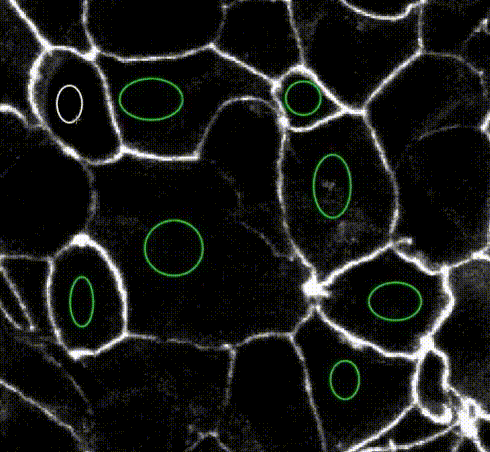
```
,
```{r, echo=FALSE, out.width="100%"}
knitr::include_graphics("images/221219-ICY-MOVIES - 25X 54 (crop)_TrackingAmoeba.gif")
```
,
```{r, echo=FALSE, out.width="100%"}
knitr::include_graphics("images/bioflow_2D.gif")
```
]         
![:col_row Credits: D. Gaboriau, Credits: M. Manich, Boquet-Pujadas et al. (2017)]

> http://icy.bioimageanalysis.org/plugin/spot-detector/         
http://icy.bioimageanalysis.org/plugin/active-contours/          
http://icy.bioimageanalysis.org/plugin/track-manager/         
http://icy.bioimageanalysis.org/plugin/bioflow/        

???
extract motion of intracellular material observed using fluorescence
microscopy, while simultaneously inferring the parameters of a given theoretical model 
actin bulk flow   


---
# Protocols         

```{r, echo=FALSE}
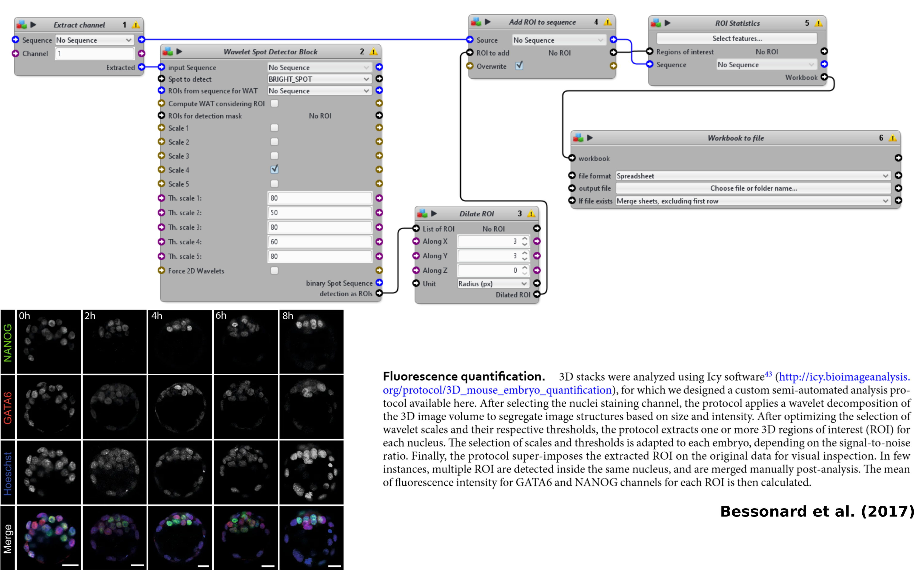
```

> http://icy.bioimageanalysis.org/protocol/3d-mouse-embryo-quantification/         
http://icy.bioimageanalysis.org/plugin/protocols/       


---
# A protocol is a workflow     

```{r, echo=FALSE}
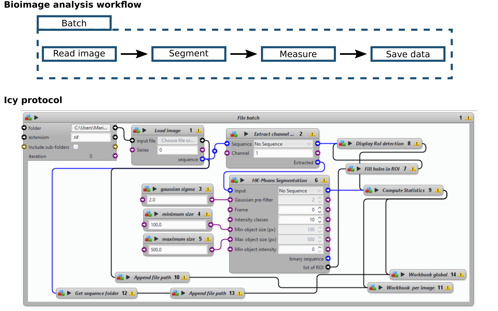
```

> http://icy.bioimageanalysis.org/protocol/cell-fluorescence-quantification/           
https://zenodo.org/record/3706554#.XpgUbZk6-Uk        


---
# A protocol is a workflow   

```{r, echo=FALSE}
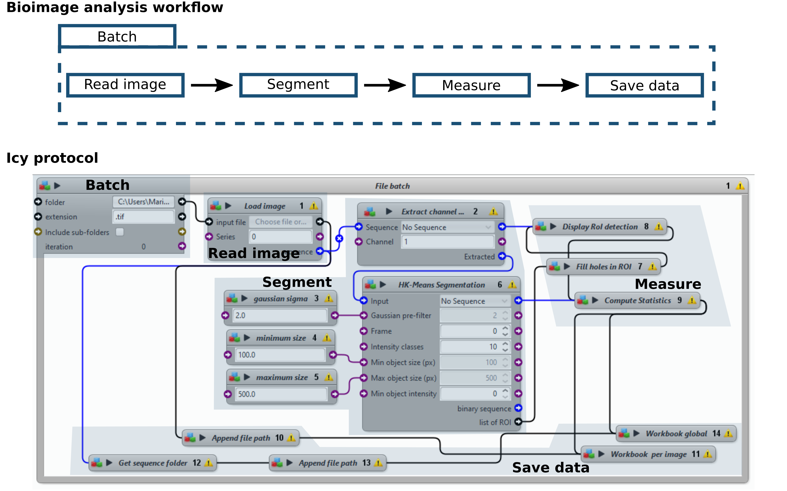
```

> http://icy.bioimageanalysis.org/protocol/cell-fluorescence-quantification/           
https://zenodo.org/record/3706554#.XpgUbZk6-Uk


---
# How to add a block           


<iframe width="700" height="400" src="https://www.youtube.com/embed/3OhFIF8wOnc" frameborder="0" allow="accelerometer; autoplay; encrypted-media; gyroscope; picture-in-picture" allowfullscreen></iframe>

> http://icy.bioimageanalysis.org/protocol/cell-fluorescence-quantification/           
https://zenodo.org/record/3706554#.XpgUbZk6-Uk  

---
# How to run the protocol           


<iframe width="700" height="400" src="https://www.youtube.com/embed/OVoGznelsEQ" frameborder="0" allow="accelerometer; autoplay; encrypted-media; gyroscope; picture-in-picture" allowfullscreen></iframe>

> http://icy.bioimageanalysis.org/protocol/cell-fluorescence-quantification/           
https://zenodo.org/record/3706554#.XpgUbZk6-Uk 

---
# Ethics and Reproducibility with protocols     

**Transparency** 
- Steps of the workflow are visible      
- All steps and corresponding parameters are stored in the .xml 

**Reproducibility**
- Automated analysis    

=> Add a DOI with Zenodo on your protocol and test data    
=> Share your protocol in your publication & on the Icy website, add documentation & link to test data          


```{r, echo=FALSE}
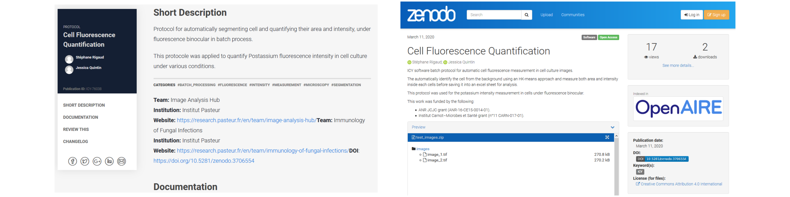
```

> http://icy.bioimageanalysis.org/tutorial/how-to-publish-a-protocol/ 

---
# Results visualisation and manipulation            

```{r, echo=FALSE}
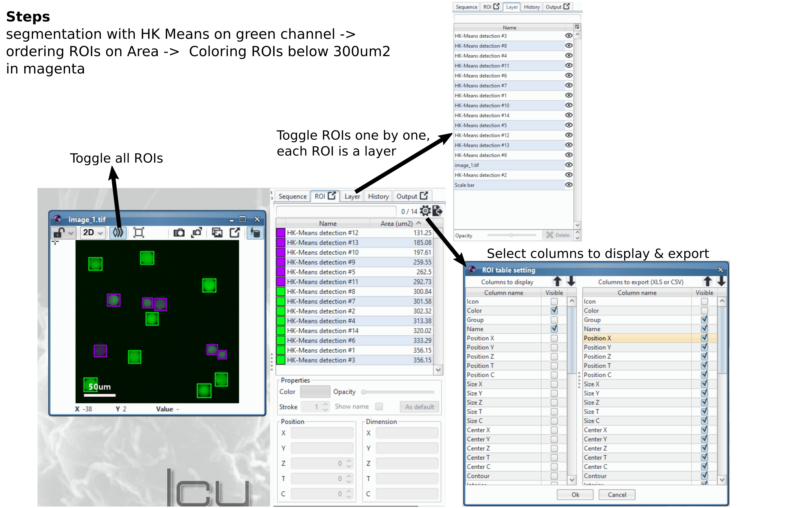
```

> Image: image_1.tif, from https://zenodo.org/record/3706554#.XpgUbZk6-Uk 


---
# Interoperability with other tools          

```{r, echo=FALSE}

```


---
# Icy resources      


```{r, echo=FALSE, out.width="100%"}
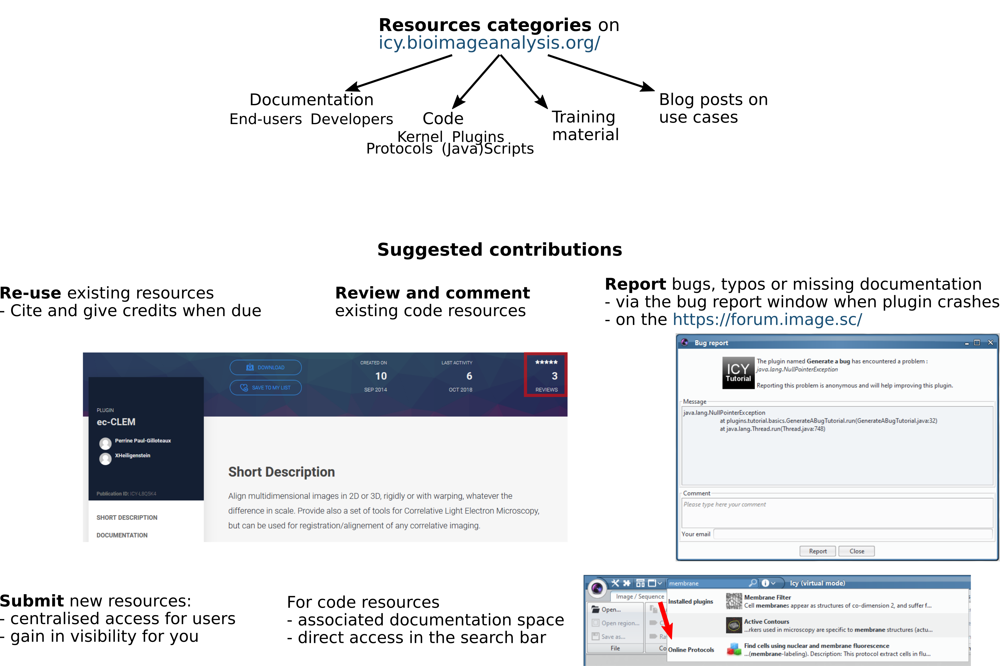
```

---
# How to cite Icy?   

*In scientific publications* 
- **Cite Icy**: de Chaumont et al. Icy: an open bioimage informatics platform for extended reproducible research. Nat Methods 9, 690–696 (2012). https://doi.org/10.1038/nmeth.2075   
- **Cite the plugins** you use: reference in the online documentation     
- **Publish your protocol**: upload it on the Icy website, add a snapshot in the supplementals, link to test data    

<br>

*On Twitter*    
Did you publish recently a paper using Icy? Did follow a course on Icy ? Do you have a favorite plugin? Are you proud of your last protocol? **Share** it!      

In your tweets: 
- **@Icy_Bioimaging** to notify the Icy team            
- **#BioimageAnalysis**, automatic retweet by the Twitter bot @Talk_BioImg

**Follow @Icy_Bioimaging** to get news from the Icy team.             

---
# How to get help & report bugs?           

**Looking for help**   

1. Read the online plugins documentation http://icy.bioimageanalysis.org/ 
2. Read the training materials http://icy.bioimageanalysis.org/trainings/            
3. Search the forums https://forum.image.sc/  


**Still looking for help?**    

Create a new topic on the image.sc forum: https://forum.image.sc/ 
```{r, echo=FALSE, out.width="75%", fig.align='center'}

```
    


---
# Questions?


